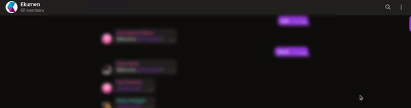
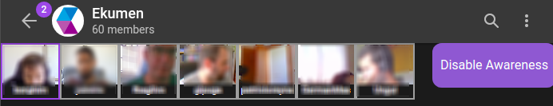

# Telegram Web Z

This project won the first prize 🥇 at [Telegram Lightweight Client Contest](https://contest.com/javascript-web-3) and now is an official Telegram client available to anyone at [web.telegram.org/z](https://web.telegram.org/z).

According to the original contest rules, it has nearly zero dependencies and is fully based on its own [Teact](https://github.com/Ajaxy/telegram-tt/tree/master/src/lib/teact) framework (which re-implements React paradigm). It also uses a custom version of [GramJS](https://github.com/gram-js/gramjs) as an MTProto implementation.

The project incorporates lots of technologically advanced features, modern Web APIs and techniques: WebSockets, Web Workers and WebAssembly, multi-level caching and PWA, voice recording and media streaming, cryptography and raw binary data operations, optimistic and progressive interfaces, complicated CSS/Canvas/SVG animations, reactive data streams, and so much more.

Feel free to explore, provide feedback and contribute.

## Local setup

```sh
cp .env.example .env

npm i
```

Obtain API ID and API hash on [my.telegram.org](https://my.telegram.org) and populate the `.env` file.

## Dev mode

```sh
npm run dev
```

### Immedia

The Immedia React component connects to the [homonymous](https://github.com/ekumenlabs/immedia)' presence aware system which displays the user and participants webcam screenshots every few seconds.

Immedia can be enabled by clicking the `Enable Awareness` button as shown below.



This component can be disabled as well by clicking the `Disable Awareness` button.



### Invoking API from console

Start your dev server and locate GramJS worker in console context.

All constructors and functions available in global `GramJs` variable.

Run `npm run gramjs:tl full` to get access to all available Telegram requests.

Example usage:
``` javascript
await invoke(new GramJs.help.GetAppConfig())
```

## Bug reports and Suggestions
If you find an issue with this app, let Telegram know using the [Suggestions Platform](https://bugs.telegram.org/c/4002).

